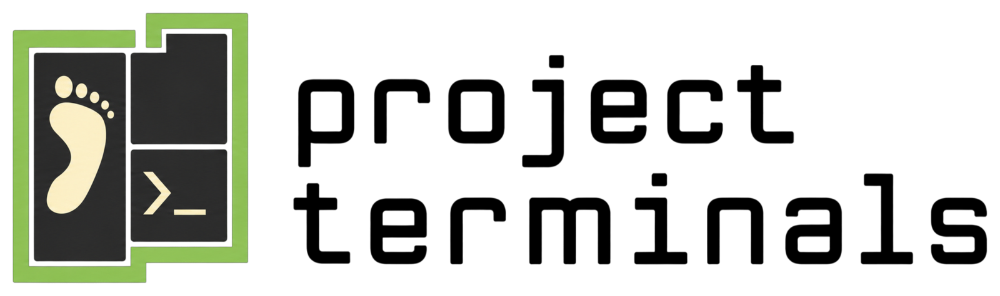

Persistent Foot terminals for dev projects.

- **Foot server** opens lightweight terminal windows
- **tmux** keeps project terminals and processes running after windows close
- **Omarchy integration** adds the Hyprland menu binding and Walker displays
  the project menu
- **Codex** conversations resume after login through a `SessionStart` hook

## Requirements

| Status | Software |
| --- | --- |
| Needed | [Omarchy](https://github.com/basecamp/omarchy), [Foot](https://archlinux.org/packages/extra/x86_64/foot/) |
| Optional | [Codex](https://github.com/openai/codex/), [Zsh](https://archlinux.org/packages/extra/x86_64/zsh/), [Fish](https://archlinux.org/packages/extra/x86_64/fish/) |

## Install

Clone, then run:

```bash
./install.sh          # detect login shell
./install.sh bash     # optional override: bash, zsh or fish
```

Set directory containing projects:

```bash
project-terminals projects-dir ~/Projects
```

Automatic restore is on by default:

```bash
project-terminals auto-restore off
project-terminals auto-restore on
```

Press `Super+Alt+Enter` to open menu. See [USAGE.md](USAGE.md) for controls.


Theme: [omarchy-lasthorizon-theme][last-horizon] from HANCORE

[last-horizon]: https://github.com/HANCORE-linux/omarchy-lasthorizon-theme
